[README.md](https://github.com/user-attachments/files/32311558/README.md)
<div align="center">



<br>

[](https://github.com/MarquesHD)
[](https://github.com/MarquesHD)


</div>


## Sobre mim

```console
root@marqueshd:~$ whoami --verbose

  nome      Marques
  função    desenvolvedor de automações + pentest de redes
  missão    transformar tarefa repetitiva em script, e rede frágil em rede auditada
  domínio   escritório, comércio, infraestrutura local

root@marqueshd:~$ _
```

Escrevo software que resolve problema real de expediente: digitalizar, conferir caixa, organizar documento, controlar estoque. E do outro lado da mesa, olho a mesma operação pela perspectiva de quem tenta entrar — para fechar a porta antes que alguém encontre.

- Sistemas de automação de rotinas operacionais
- Ferramentas de estoque, caixa e documentos
- Testes de intrusão e hardening em redes locais


## Arsenal

| Tecnologia | Domínio | Onde uso |
|---|---|---|
| **Python** | `▰▰▰▰▰▰▰▰▰▱` Avançado | automação, scanners, scripts de auditoria |
| **JavaScript** | `▰▰▰▰▰▰▱▱▱▱` Intermediário | ferramentas web offline, interfaces de caixa |
| **HTML/CSS** | `▰▰▰▰▰▰▱▱▱▱` Intermediário | front das ferramentas internas |
| **SQL** | `▰▰▰▰▰▰▱▱▱▱` Intermediário | consultas, relatórios, base de estoque |
| **C#** | `▰▰▰▱▱▱▱▱▱▱` Básico | integrações com Windows |

<div align="center">


</div>


## Pentest de redes

Segurança ofensiva aplicada à infraestrutura que eu mesmo automatizo: mapear o que está exposto, medir o estrago possível e entregar o caminho da correção.

| Frente | O que envolve |
|---|---|
| **Reconhecimento** | mapeamento de hosts, portas e serviços, levantamento de superfície exposta |
| **Rede interna** | segmentação, VLANs, tráfego em claro, compartilhamentos e credenciais fracas |
| **Wi-Fi** | avaliação de padrões de autenticação, isolamento de clientes, rede de visitantes |
| **Análise de tráfego** | captura e leitura de protocolos para achar dado sensível trafegando aberto |
| **Hardening** | correção, política de senha, atualização, fechamento do que não precisa existir |
| **Relatório** | achados priorizados por risco, com passo de correção em linguagem de gestor |

```console
root@marqueshd:~$ audit --scope lan --mode autorizado

  [✓] escopo assinado antes da primeira varredura
  [✓] janela de teste combinada com o responsável
  [✓] achados entregues com prazo e correção
  [✗] nada fora do contrato. nunca.

root@marqueshd:~$ _
```

> Todo trabalho ofensivo aqui é feito em laboratório próprio ou em ambiente com autorização formal por escrito. Teste sem permissão é crime — no Brasil, Lei 12.737/2012 e Lei 14.155/2021.


## Projetos

<details open>
<summary><b>Scanner Contínuo — Samsung M4070FR</b> · Python · customtkinter · WIA</summary>

<br>


Digitaliza direto da multifuncional e junta várias páginas em um único PDF, sem passar pelo software da fabricante.

- Digitalização contínua de múltiplas páginas
- Salvamento automático em PDF
- Interface com tema claro/escuro
- Executável para rodar em máquina sem Python

[**Abrir repositório →**](https://github.com/MarquesHD/Scanner-continuo-da-impressora-Samsumg-M4070FR)

</details>

<details>
<summary><b>Contador de Caixa</b> · HTML · CSS · JavaScript</summary>

<br>


Fechamento de caixa por denominação, para acabar com a conferência no papel.

- Contagem de cédulas e moedas
- Subtotal e total automáticos
- Resumo detalhado do fechamento
- Impressão do relatório

[**Abrir repositório →**](https://github.com/MarquesHD/Calculadora-de-Dinheiro)

</details>

<details>
<summary><b>PDF Editor & Organizer</b> · PDF.js · jsPDF · html2canvas</summary>

<br>


Mescla, reordena e limpa páginas de PDF e imagem direto no navegador — nada sobe para servidor nenhum.

- Importação de PDF e imagem (JPG, PNG)
- Mesclagem de múltiplos documentos
- Reorganização por arrastar e soltar
- Exclusão de páginas individuais
- Exportação em PDF compactado

[**Abrir repositório →**](https://github.com/MarquesHD/Imagens-para-PDF)

</details>

<details>
<summary><b>Gestor de Estoque</b> · em consolidação</summary>

<br>

Controle de produtos para quem precisa saber o que tem, o que saiu e o que está acabando.

- Cadastro de produtos
- Controle de entrada e saída
- Relatórios de estoque
- Alerta de estoque baixo

[**Abrir repositório →**](link-do-repositorio)

</details>


## Números

<div align="center">


<br><br>


<br>


</div>


## Em construção

- [ ] Sistema de gestão financeira completo
- [ ] App mobile para gestão de estoque
- [ ] Integração entre os sistemas existentes
- [ ] Laboratório de pentest documentado, com relatórios de exemplo

## Contato

<div align="center">

[](mailto:seu-email@exemplo.com)
[](https://linkedin.com/in/seu-usuario)
[](https://github.com/MarquesHD)

</div>


<div align="center">

**Se algum destes projetos te poupou tempo, deixa uma estrela.**

<sub>Última atualização: 14/08/2026</sub>

</div>
